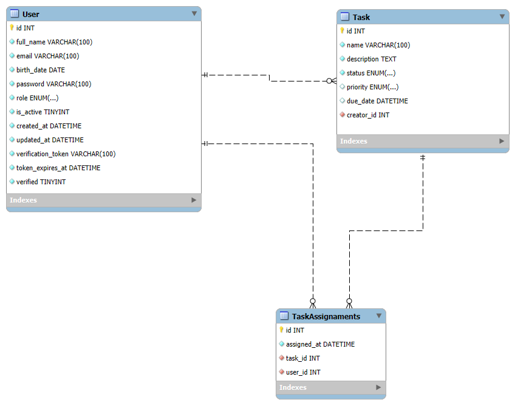
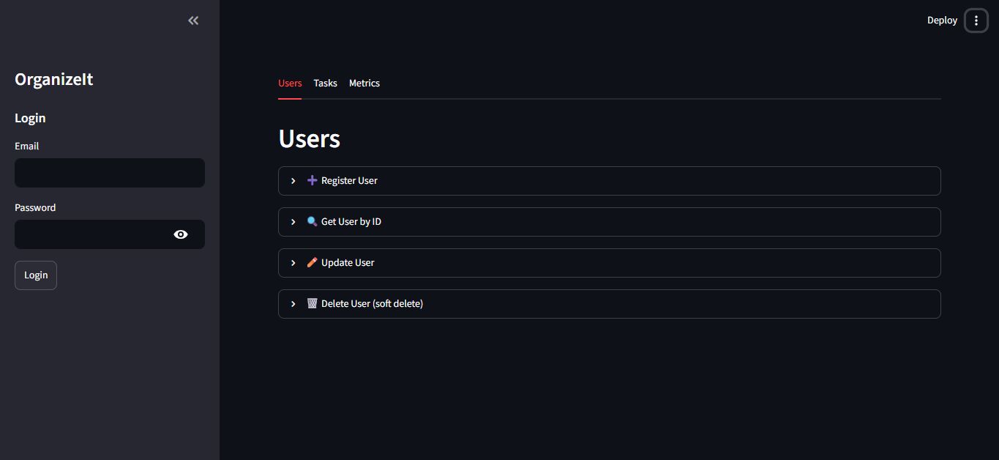

# OrganizeIt

A RESTful API for collaborative task management, built with FastAPI and MySQL. The API handles users, tasks, and authentication, following Clean Architecture with clear separation between routers, services, repositories, and models.

---

## Technologies

- **Python 3.13**
- **FastAPI** — web framework
- **SQLAlchemy** — ORM
- **Alembic** — database migrations
- **MySQL** — database
- **Pydantic** — data validation
- **python-jose** — JWT authentication
- **passlib (bcrypt)** — password hashing
- **smtplib** — email notifications
- **Streamlit** — interactive UI
- **pytest** — automated testing
- **python-dotenv** — environment variable management

---

## Project Structure

```
app/
├── api/
│   ├── routes/        # Routers for each resource
│   └── deps.py        # Shared dependencies (get_db, get_current_user)
├── core/
│   ├── db.py           # Database configuration
│   └── security.py     # JWT and password hashing
├── models/
│   └── models.py       # SQLAlchemy models
├── schemas/             # Pydantic schemas (input/output)
├── service/
│   ├── service.py       # Business logic
│   └── email_service.py # Email notifications (SMTP)
├── repository/
│   └── repository.py    # Database access
├── enums.py              # Shared enums
└── main.py               # Application entry point
alembic/                  # Alembic migrations
tests/                     # Automated tests (pytest)
ui.py                      # Streamlit interface
```

## Database Schema


---

## UI


---

## Architecture

The project follows **Clean Architecture** in layers:

- **Interface** (`api/routes/`) — receives HTTP requests, the only layer aware of FastAPI
- **Schemas** (`schemas/`) — validates input and output data via Pydantic
- **Service** (`service/`) — business rules, permissions, and validations
- **Repository** (`repository/`) — exclusive database access via SQLAlchemy
- **Models** (`models/`) — entity definitions

Dependency injection is used throughout — the `Service` receives a `Repository` instance instead of instantiating it internally, which decouples the layers and made it possible to test the `Service` with a `FakeRepository`, without touching the database.

---

## Getting Started

### Prerequisites

- Python 3.10+
- MySQL server running locally
- Gmail account with an app password (for email notifications)

### Installation

1. Clone the repository:
```bash
git clone https://github.com/your-username/OrganizeIt.git
cd OrganizeIt
```

2. Create and activate a virtual environment:
```bash
python -m venv .venv

# Windows
.venv\Scripts\activate

# Linux/macOS
source .venv/bin/activate
```

3. Install dependencies:
```bash
pip install -r requirements.txt
```

4. Configure environment variables by creating a `.env` file in the project root:
```
DB_USER=your_mysql_user
DB_PASSWORD=your_mysql_password
DB_HOST=localhost
DB_PORT=3306
DB_NAME=organize_it
SECRET_KEY=your_secret_key
ALGORITHM=HS256
ACCESS_TOKEN_EXPIRE_MINUTES=30
EMAIL_USER=your@gmail.com
EMAIL_PASSWORD=your_gmail_app_password
```

5. Create the database in MySQL:
```sql
CREATE DATABASE organize_it;
```

6. Run the migrations:
```bash
alembic upgrade head
```

7. Start the server:
```bash
cd app
uvicorn main:app --reload
```

The API will be available at `http://localhost:8000`.  
Interactive documentation (Swagger UI) is available at `http://localhost:8000/docs`.

8. (Optional) Start the UI, from the project root, in a separate terminal:
```bash
streamlit run ui.py
```

The UI will be available at `http://localhost:8501`.

---

## Endpoints

### Users
| Method | Endpoint | Description |
|--------|----------|-------------|
| POST | `/users/` | Create a new user |
| GET | `/users/{id}` | Get a user by ID (admin only) |
| PUT | `/users/{id}` | Update a user (owner or admin) |
| DELETE | `/users/{id}` | Soft delete a user (owner or admin) |

### Tasks
| Method | Endpoint | Description |
|--------|----------|-------------|
| POST | `/tasks/` | Create a new task (admin only) |
| GET | `/tasks/{id}` | Get a task by ID |
| GET | `/tasks?assignedTo={userId}` | List tasks assigned to a user |
| PUT | `/tasks/{id}` | Update a task (admin only) |
| DELETE | `/tasks/{id}` | Delete a task (admin only) |
| POST | `/tasks/{id}/assignments` | Assign a user to a task (admin only) |

### Auth
| Method | Endpoint | Description |
|--------|----------|-------------|
| POST | `/auth/login` | Authenticate a user, returns a JWT token |
| POST | `/auth/logout` | Invalidate the current token |

### Metrics
| Method | Endpoint | Description |
|--------|----------|-------------|
| GET | `/metrics/tasks-by-status` | Count of tasks grouped by status |
| GET | `/metrics/tasks-by-user` | Count of tasks grouped by user (optionally filtered by `user_id`) |

---

## Business Rules

- Roles are defined as `ADMIN`, `USER`, and `GUEST`.
- Only admins can create, update, delete, and assign tasks.
- Only admins can view another user's information.
- A user can update or delete their own account; admins can do it for any user.
- User deletion is a soft delete — the `is_active` flag is set to `False`.
- Task deletion is a hard delete — the record is permanently removed.
- Logging out invalidates the current JWT by storing it as the user's `banned_token`; the same token cannot be reused afterward.
- Users receive an email notification when a task is assigned to them or updated.

---

## Testing

The project includes automated tests for the `Service` and `Repository` layers using `pytest`.

- **Service tests** use a `FakeRepository`, isolating business logic from the database.
- **Repository tests** use an in-memory SQLite database, isolating database access from MySQL.

Run the tests from the project root:
```bash
pytest tests/ -v
```

---

## License

This project is for educational purposes.